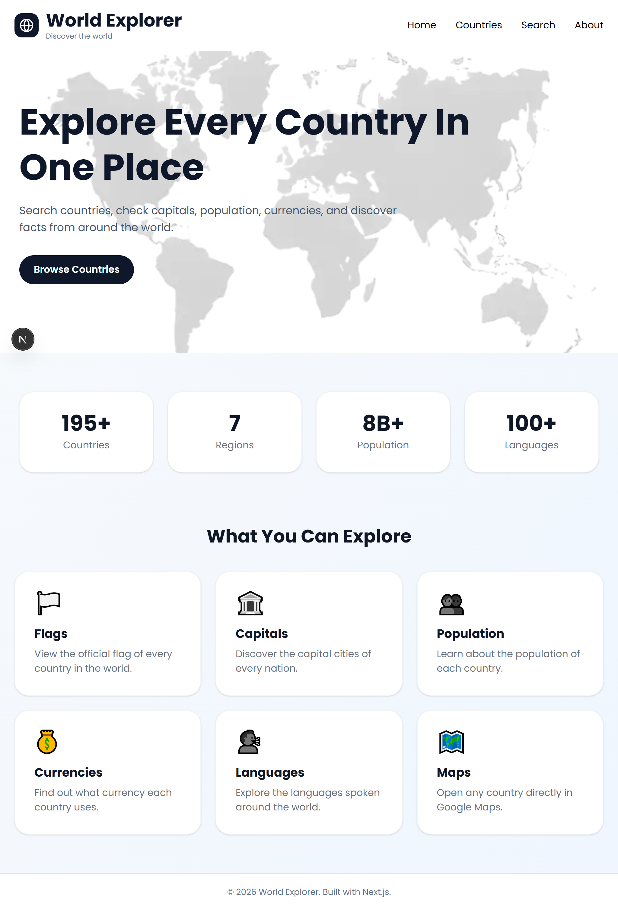
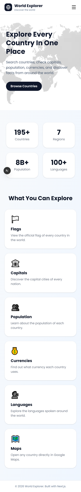
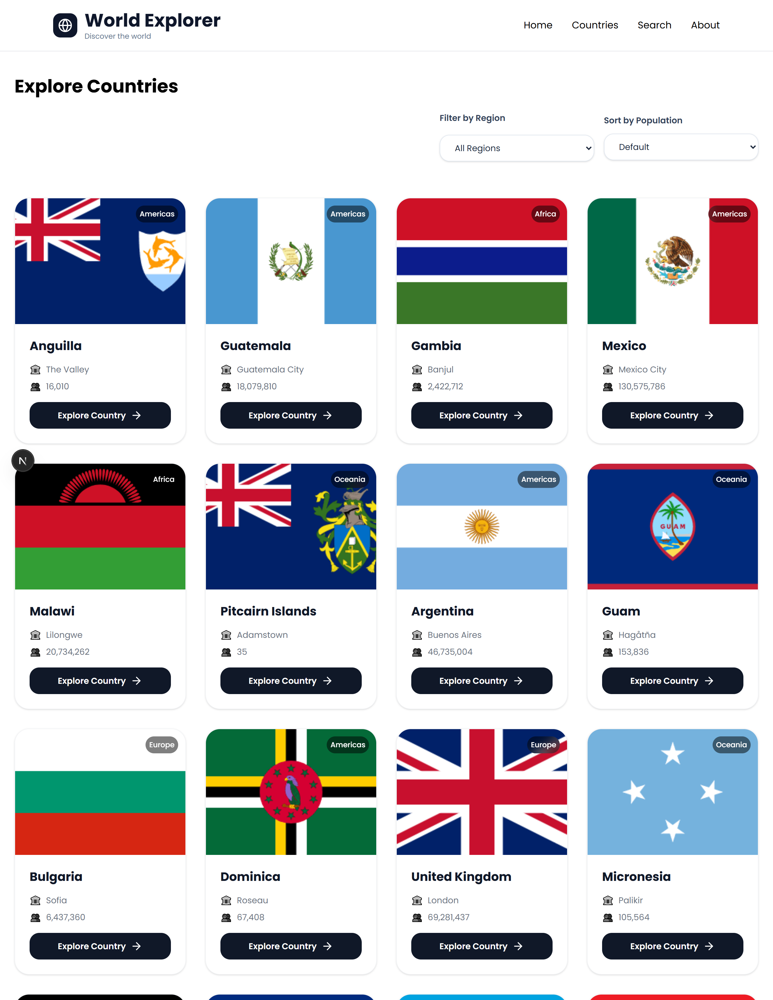
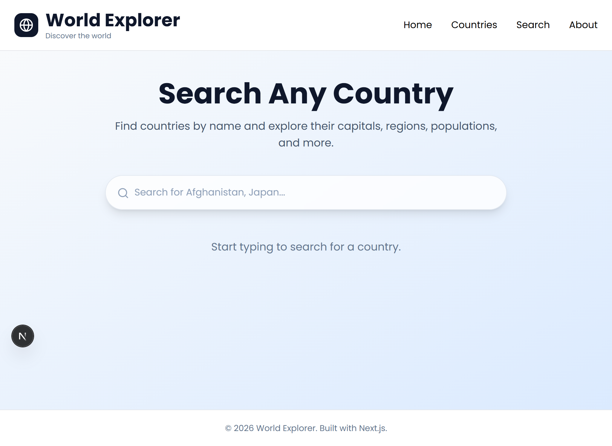
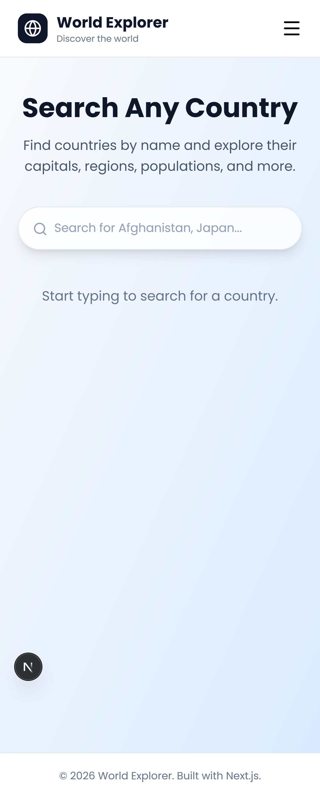
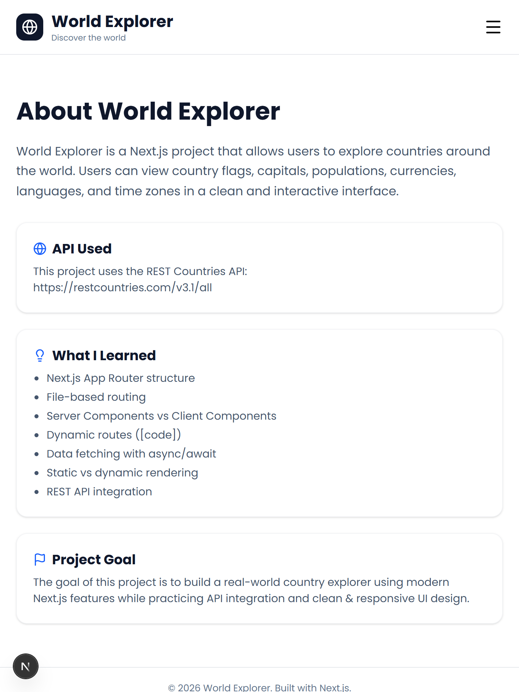
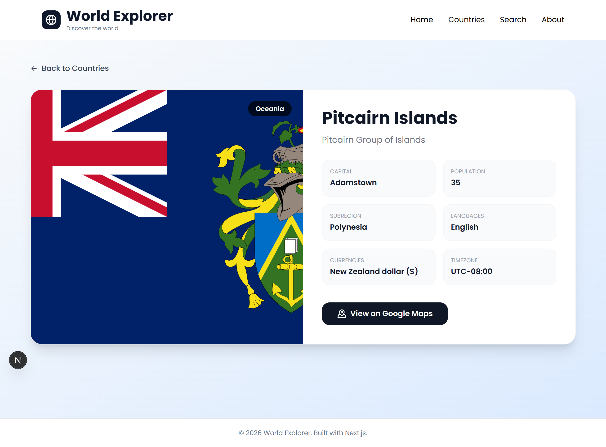
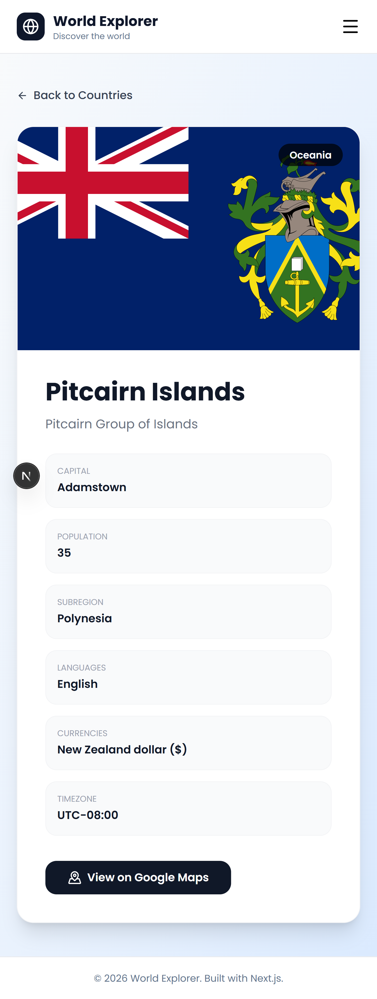

# World Explorer

World Explorer is a Next.js project that allows users to explore countries around the world. Users can view country details, search for countries, and filter them by region and population.


## Features

- Built with Next.js App Router
- File-based routing
- Server and Client Components
- Dynamic routes for country details
- Data fetching using REST Countries API
- Search functionality
- Region filtering
- Population sorting
- Loading UI using loading.tsx
- Custom 404 page using not-found.tsx
- Responsive design with Tailwind CSS


## API Used

REST Countries API  
https://restcountries.com/v3.1/all

## Pages

- Home Page: Introduction to the project
- Countries Page: Displays a list of countries with filters and sorting
- Country Details Page: Shows detailed information about a selected country
- Search Page: Allows users to search countries by name
- About Page: Project overview and technologies used


## Installation

```bash
npm install
npm run dev
Run Locally

After installing dependencies, start the development server:

npm run dev

Then open:
http://localhost:3000

Project Structure
app/ - Pages and routing
components/ - Reusable UI components
types/ - TypeScript interfaces
```


## Screenshots

### Home Page



### Countries Page


### Search Page



### About Page


### Detail Page





Author

Built as a learning project for practicing Next.js and frontend development.
